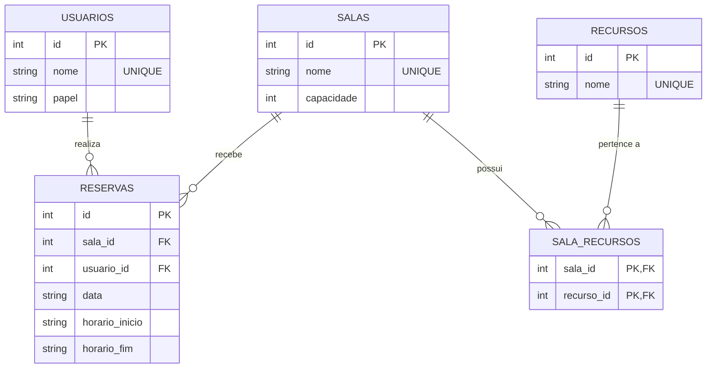
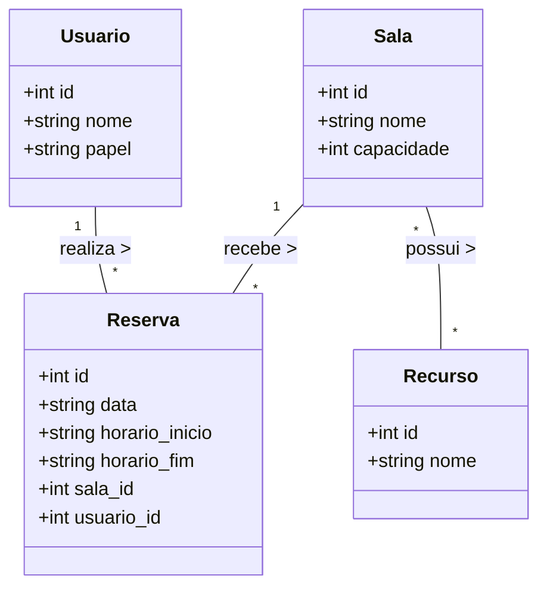

# TP1 - Sistema de Reserva de Salas

## Membros e Papéis
* **Guilherme Bacelar Teixeira** - [Papel: Backend] 
* **Pedro Henrique Egito Aguiar** - [Papel: Frontend] 

---

## Objetivo do Sistema
O sistema visa gerenciar o agendamento de espaços comuns, permitindo que usuários visualizem a disponibilidade e realizem reservas de forma autônoma. O foco é evitar conflitos de horários e facilitar a organização do uso dos espaços físicos da instituição. A aplicação será composta por uma API em Flask, interface Web em React e persistência de dados em SQLite.

---

## Tecnologias
* **Frontend:** React + Vite
* **Backend:** Flask (Python)
* **Banco de Dados:** SQLite
* **Autenticação:** Token JWT / Authorization header

---

## Funcionalidades Implementadas
* Cadastro e login de usuários
* Validação de autenticação e proteção de rotas via token
* Cadastro e listagem de salas, recursos e usuários
* Consulta de disponibilidade de sala por data
* Criação, listagem e cancelamento de reservas
* Painel administrativo com:
  * cadastro e edição de salas
  * cadastro e remoção de recursos
  * cadastro de usuários
  * promoção de usuários a admin
  * despromoção de admins
  * exclusão de usuários
  * listagem de todas as reservas
  * filtros de reserva por sala e data
  * calendário de reservas por mês
  * visualização do nome do responsável pela reserva

---

## Histórias de Usuário Atualizadas
1.  **Visualizar Salas:** Como usuário, quero visualizar a lista de todas as salas cadastradas.
2.  **Consultar Detalhes:** Como usuário, quero ver capacidade e recursos de uma sala específica.
3.  **Verificar Disponibilidade:** Como usuário, quero consultar horários ocupados de uma sala para uma data específica.
4.  **Realizar Reserva:** Como usuário, quero reservar uma sala informando data e horário.
5.  **Meus Agendamentos:** Como usuário, quero visualizar minhas reservas confirmadas.
6.  **Cancelar Reserva:** Como usuário, quero cancelar minha reserva quando não precisar mais.
7.  **Cadastrar Sala (Admin):** Como administrador, quero cadastrar novas salas com nome, capacidade e recursos.
8.  **Gerenciar Recursos (Admin):** Como administrador, quero cadastrar e remover recursos.
9.  **Gerenciar Usuários (Admin):** Como administrador, quero criar, promover, despromover e excluir usuários.
10. **Visualizar Reservas Globais (Admin):** Como administrador, quero ver todas as reservas, filtrar por sala/data e navegar por calendário.
11. **Mostrar Nome do Responsável:** Como administrador, quero ver o nome do usuário responsável pela reserva em vez do ID.

---

## Documentação UML

### 1. Diagrama de Entidade-Relacionamento (Banco de Dados)
O diagrama abaixo ilustra o esquema relacional do banco de dados `banco.db` (SQLite), exibindo as 5 entidades projetadas, seus atributos e as regras de Associação (Muitos para Muitos) adotadas para os Recursos.

### 2. Diagrama de Sequência (Fluxo da API)
Este diagrama detalha o processo rigoroso de validação de "Edge Cases" e conflitos que nossa API Flask realiza antes de autorizar uma nova gravação no banco de dados.

```mermaid
sequenceDiagram
    actor Usuario
    participant API as Flask API (/reservas)
    participant DB as SQLite (banco.db)

    Usuario->>API: POST /reservas (JSON: sala, usuario, horarios)
    API->>DB: SELECT id FROM usuarios
    DB-->>API: (Retorna True se existe)
    API->>DB: SELECT id FROM salas
    DB-->>API: (Retorna True se existe)
    API->>DB: SELECT horarios FROM reservas WHERE sala = X e data = Y
    DB-->>API: Lista de reservas já cadastradas hoje
    
    rect rgb(0, 0, 0)
        note right of API: Algoritmo lógico em Python intercepta e avalia cruzamento:<br>(novo_inicio < BD_fim AND novo_fim > BD_inicio)
    end
    
    alt Houve Conflito
        API-->>Usuario: 409 Conflict {"erro": "Conflito de horário"}
    else Sem Conflito
        API->>DB: INSERT INTO reservas (...)
        DB-->>API: (ID da Reserva gerado Auto-Incrementado)
        API-->>Usuario: 201 Created (Comprovante JSON)
    end
```

### 3. Diagrama de Classes (Estrutural)
Este diagrama apresenta a visão estática do domínio do sistema, de acordo com os padrões UML, ilustrando as entidades principais, seus atributos e os relacionamentos conceituais (Multiplicidade) entre elas.

